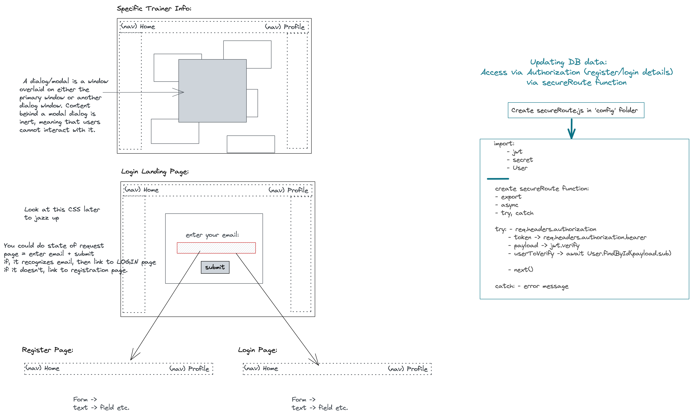

# GA Project 3: ‘Nike x Collab’

## Overview
During General Assembly’s Software Engineering Immersive course, my third project was to create our first full-stack project using the MERN stack.

We used express in the backend to store user-generated data in a custom mongoDB database, whilst connecting the data to a frontend using React. 

My chosen topic was to create an online database showcasing past and present Nike trainer collaborations. User registration and authentication allowed data to be pushed into an existing database and showcased via the app. 


## Navigation

* [The App](#the-app)
* [The Brief](#the-brief)
* [Technologies Used](#technologies-used)
* [General Approach](#general-approach)
  * [Planning](#planning)
  * [Wireframing](#wireframing)
* [Build Approach](#build-approach)
  * [Frontend Interface](#front-end-interface)
  * [Backend Models and Controllers](#backend-models-and-controllers)
* [Demo](#demo)
* [Challenges](#challenges)
* [Wins](#wins)
* [Key Learnings](#key-learnings)
* [Future Improvements](#future-improvements)
* [Credits](#credits)

## The App

|                           |                           | 
|:-------------------------:|:-------------------------:|
|   |  |
|  |  | 


## The Brief
* Build a full-stack application using MongoDB, an Express API, React and Node.js.
* Use the Express API to serve your data from a Mongo database. 
* Consume your custom API with a separate front-end with React. 
* Explore at least one relationship and CRUD functionality with a couple of models. 
* Incorporate user registration, login and authentication. 
* Submit a wireframe and object diagram (UML). 
* Time: One Week.

## Technologies Used
 * JavaScript (ES6+)
 * HTML5/CSS3/SASS
 * MERN Stack (MongoDB, Express.js, React.js, Node.js)
 * Mongoose
 * JSON Web Token
 * Bootstrap
 * Axios
 * Visual Studio Code & ESlint
 * Git & GitHub
 * Insomnia

## General Approach

### Planning
With a keen interest in Nike trainers, I wanted to create a platform for an online source of inspiration and perhaps later down the line a forum where users could upload and contribute to a database of Nike collaborations through time. 

I set out by creating a moodboard of websites and stylised features I could potentially use and created my wireframe and moodboard from this in tangent. Having a clear idea of what the end product should aim to look like design wise is always an important process for me, with the acceptance that things can evolve and change through time. 


### Wireframing




__Object Model Diagram__


## Build Approach
App features: 
    * Display of nike trainer collaboration database. Any user with access to the link can view this data. 
    * User registration and authentication allows users to add their own input, adding / deleting entries. Each input will be uniquely associated with the user login details. 
    * Create a RESTful API. 


Day 1:   Planning. 
Day 2&3: Setting up the backend with node.js, ensuring express, mongoose, mongoDB, the router and port were connected successfully. The database was linked up with my seed database too. 
Day 4:   Finishing the backend and setting up a React file. 
Day 5:   Styling
Day 6:   Styling
Day 7:   Presentation and tidying up any issues


### Frontend Interface
* Set up API, Axios and Get Request Method. 
* Understanding Routing (BrowserRouter, Routes, Route). 
* Using components. 
* Using Bootstrap templates for forms. 
* User registration forms, user login/logout format. 
* Utilise useNavigate. 

__React Router__
* I used multiple components to navigate around the app as separate pages. 
* Link components further allowing us to navigate around the site without reloading the page. 
Navbar always present. 

__Post Requests and Authentication__
* User registration and login details (username, email, password) required to allow access and authentication in parts of your app. 

__Registration:__
We must ensure we are updating state once we submit form data, rather than simply logging it: 

```javascript
 const handleChange = (e) => {
   setFormData({ ...formData, [e.target.name]: e.target.value })
   setErrors({ ...errors, [e.target.name]: '' })
 }
```
Here we are checking the data to see if there are any errors in the form submit. Note, the dot notation shown in the error is based on the API and how far it is required to dig down (and will therefore be different for each API used). 

```javascript
 const handleSubmit = async (event) => {
   event.preventDefault()
   try {
     await axios.post('api/register', formData)
     navigate('/collaborations')
   } catch (err) {
     console.log(err) 
     console.log(err.response) 
     console.log(err.response.data.errors) 
     setErrors(err.response.data.errors)
   }
 }
```

Thus showing the user any errors if they arise:
```javascript
 const [ errors, setErrors ] = useState({})
```

Furthermore, the returning form page:
showing to the user if any information matches, it will be displayed (using tracking state) (see second line): 

```javascript
    <input type="text" name="username" className='input' placeholder='Username' value={formData.username} onChange={handleChange} />

    {errors.username && <p className='text-danger'>{errors.username}</p>}
```

If a user is able to login, we are returned a token which can then be used to send back to our authentication request. 
  * Token allows us to make authenticated requests. 
  * We can use it and validate it. 
  * Allows users that are logged in or not to access various pages. 
  * We use useNavigate() to update the menu page to indicate whether a user is logged in or not (sign in / sign out).  

__Styling__
  * I chose not to use a framework here as I wanted to explore different CSS features and play around with ideas without being constrained. I did however use Bootstrap for the sign in & registration form. 

__SASS__
  * This was my first experience trying to use SASS effectively, creating preset themes for fonts and colours, and breaking out into components and nesting properties. 
  * There is a lot more to understand with SASS and I merely scratched the surface here. 

### Backend Models and Controllers
  * Adding secure mode to API user and secret/password protection via a .env file. 
  * Creating database models with mongoose.Schema.
  * Accessing this data via request (route) parameters.
  * Creating controllers. 
  * Initialising User Authentication. 
  * Updating database documents with Authentication. 
  * Assigning ObjectId to data with reference relationships. 
  
__Controllers__
  * We link the data from our models (collaborations.js & users.js) to a template using a controller. These hold a set of functions (one for each route that they need to handle). 
  * In this project I used POST, GET, PUT, DELETE. 
  

__Relationships__
  * Mongoose allows us to build relationships. Using the unique identifier to identify individual documents. 
  * Here I used a reference relationship (where the user and database can co-exist independently but also work together). Creating a unique user id to add to objects in the database so that every object is owned by a user. User can therefore post, delete (and update) their own objects and prevents anyone else from doing so. 
  * In our models, we can add an owner to each object. 
  
  ```javascript
    const collabSchema = new mongoose.Schema({
     collaboration: { type: String, required: true },
     status: { type: String },
     year: { type: String, required: true },
     description: { type: String, required: true, maxLength: 700 },
     image1: { type: String },
     url: { type: String },
     owner: { type: mongoose.Schema.ObjectId, ref: 'User', required: true },
     createdAt: { type: Date, default: Date.now }
    })
  ```
  
 We then reference this model in our user model to check if there’s any id that matches the one on the object model, therefore creating the relationship of pairing the two models together.  
 
  ```javascript
  export default mongoose.model('User', userSchema)
  ```
 
Here we can go further and return information to us about the specific object and also about the owner assigned to it. Using a GET method we can request a single Nike and it’s owner to be returned 

  ```javascript
  export const getSingleCollab = async (req, res) => {
   const { id } = req.params
   try {
     const selectedCollab = await Collab.findById(id).populate('owner')
     if (!selectedCollab) {
       return res.status(404).json({ message: "Collaboration not found" })
     }
     return res.status(200).json(selectedCollab)
   } catch (err) {
     console.log(err)
     return res.status(500).json({ message: "Something went wrong." })
   }
  }
  ```
  
  We can return the owner info. whilst removing their password as we don’t want to return this. We do this in our user model. The userSchema uses a transform method to pass through the _doc and json and deleting a key (the password) off the object. 

```javascript
  userSchema.set('toJSON', {
 virtuals: true,
 transform(_doc, json){
   // Second parameter passed is the json object that is due to be sent back to the user
   //we want to remove the password from it
   delete json.password
   return json
 }
})
```

__Posting New Data__
Ensuring that we are assigned to a secureRoute (by including an authorization header in our request), we use the mongoose-unique-validator and our secureRoute.js component. This links to our collaborations controller and the POST method. Once the user has been verified, they can now attached their verification / id onto the post. 
  * In this secureRoute function, we check to see if an Authorization header exists, and if it doesn’t it throws an error. 
  * If it does, we verify the token using a method provided by jwt. 
  * If the token is valid, we need to ensure the user exists. We use the id from the payload.sub, and fun the findById method. 
  * If it returns a user, we successfully verify them. If not, we reject the request.  
  

export const addCollab = async (req, res) => {
 const { body: newCollab, verifiedUser } = req
 console.log('verifiedUser ->', verifiedUser)
 try {
   console.log('req.body', newCollab)
   const addedCollab = await Collab.create({ ...newCollab, owner: verifiedUser._id })
 
   return res.status(200).json(addedCollab)
 } catch (err) {
   console.log("Can't add this Collaboration!")
   console.log(err)
   return res.status(400).json(err.collaboration)
 }
}

export const secureRoute = async (req, res, next) => {
 console.log('🚨 HIT THE SECURE ROUTE***')
 try {

      


[Demo](#demo)


